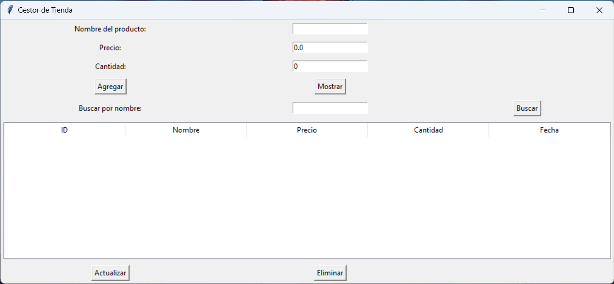

# GestorDeNegosio

## Descripción

es para organizar los productos de un negosio
Este programa esta desarrollado en python con una interfaz grafica

#### Pasos para usar lo

1. Installarse python de https://www.python.org/
2. Abre el cmd o terminal y ejecuta python3 o py GestorDeNegocios.py

y listo para utilizar lo

### Miniatura

